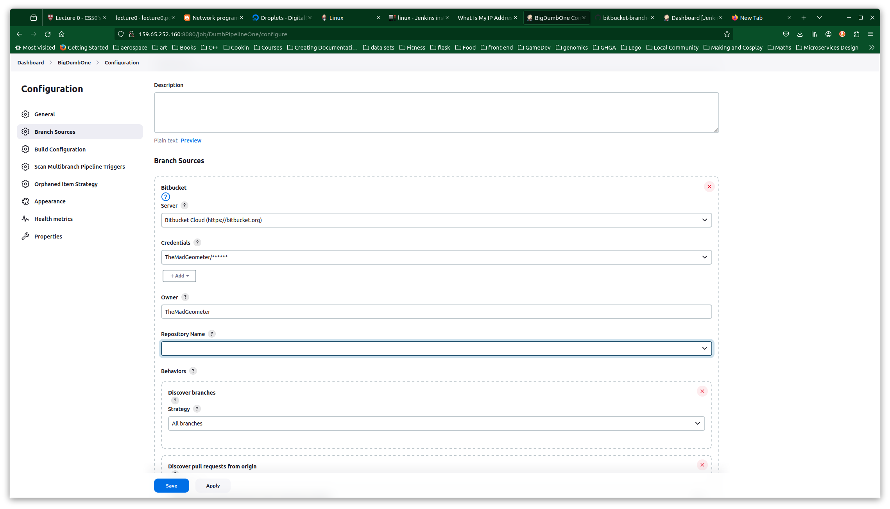

This is a repo that will have a dummy Jenkinsfile that will be used to trigger the dummy Jenkins pipeline from a second repo.

# Notes on making it work

## Key Checking

When setting up Jenkins, I used the known_hosts strategy for checking the host key on bitbucket. To do this, you must add a known_hosts file at the
path: `/var/lib/jenkins/.ssh/known_hosts`. Then you populate it with:

`ssh-keyscan -H bitbucket.org >> /var/lib/jenkiins/.ssh/known_hosts`

This enables you to hit that host without failing over the strict key checking. You could, alternatively, either not do key
checking or accept the first connection, but both options are less secure.

## Let's Talk Plugins

So far, I haven't added any special plugins, but my objective is to get two pipelines that trigger on two occasions:

1. When a new PR is uploaded.
2. When a new artifact hits Artifactory. 

My mission here is to figure out which plugins to use and how to configure them.

### Trigger Build when a new PR is Uploaded

We're going to experiment with the use of a plugin called _Generic Webhook Trigger_. This plugin enables Jenkins to take
any HTTP request, extract information from it, and run a pipeline accordingly.

Once you install the plugin, you need to run your pipeline once for the options to show up in the View Configuration
menu for that Multibranch Pipeline. But this pipeline appears to only set up triggers on a branch-by-branch basis. I can
see in the `main` branch that I can trigger the main branch by generic webhook, but I want to be able to trigger ALL the
branches that way and configure it at once. 

Following along with this blog post by the person who developed the [Generic Webhook Scan Plugin](http://bjurr.se/continuous-integration-with-gitlab-and-jenkins/),
we install the following plugins:

- Generic Webhook Scan Plugin
- Violation Comments to BitBucket Server
- HTTP Request Plugin
- Conditional Build Step Plugin

_Well Acktchyuuuuuuallly_, it looks like maybe the way to do this is with the Multibranch Scan Webhook Trigger Plugin.

This requires setting up a webhook in Jenkins to point at:

`http:<username>:password@http://<jenkins_url>/multibranch-webhook-trigger/invoke?token=<token>`

This definitely works for doing scans when someone pushes to the repo in BitBucket. Let me make sure it works for PRs...

And it detects the creation of new branches. I just need to get it to create a pipeline for PRs...

The creation of a PR triggered a multi-branch scan, but it did not create a branch for the PR, as anticipated. It looks
like my best bet is the use of an additional plugin: _BitBucket Branch Source_.

I installed BitBucket Branch Source, and its purpose is to enable PR branches to be built; however, it was not working
with my installation of Jenkins and my instance of BitBucket. I currently have Jenkins `2.426.3`, while the BitBucket
Branch Source plugin asks for Jenkins version `2.401.3`. My guess is that there is an incompatibility here. I'm going
to see if I can downgrade Jenkins and get it to work. Otherwise, I'm going to become irritated. 

